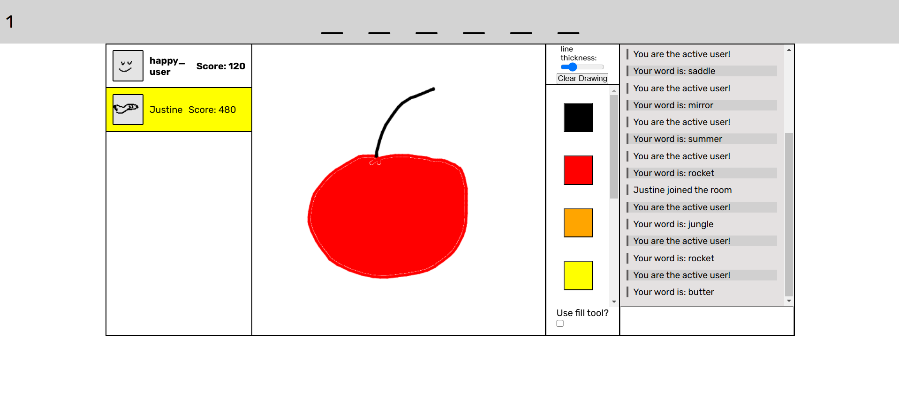

# NotSkribblio

Webpage available at: https://notskriblio.onrender.com/

**!!! Please be patient, the server takes some time to start up after a period of inactivity !!!**

Notskribbl.io is an online multiplayer game inspired by the popular drawing and guessing game Skribbl.io. In Notskribbl.io, players take turns drawing prompts while other participants attempt to guess what is being drawn. The objective of the game is to score points based on how quickly and accurately the players guess the drawings.

## How It's Made: 

NotSkribblio is built using Node.js with a backend powered by Express.js, while Socket.IO enables real-time, bidirectional communication between the server and clients for instant updates during the game. The code is written in TypeScript, providing type safety and enhanced developer experience. The user interface is styled with basic CSS, ensuring a clean and responsive design for an intuitive gameplay experience. Together, these technologies create a smooth, interactive drawing and guessing game with seamless multiplayer functionality.

## Optimizations/Other

Plans for changes:
- Make round-end screen also display scores
- Make something show up when the game ends
   - Display final rankings
   - Players stay in the game, but their scores are reset
- undo/redo buttons (hard to implement)
- Add icon to the site
- Make clicking without dragging on the canvas draw a circle
- Make it possible to configure settings for created lobbies
Bugs:
- Lobbies can be abused by manually changing view of the page to join lobbies repeatedly